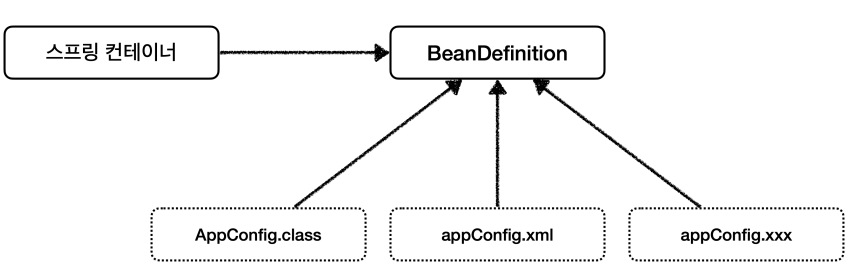

# 스프링 컨테이너와 스프링 빈
## 스프링 컨테이너 생성
```java
ApplicationContext applicationContext = new AnnotationConfigApplicationContext(AppConfig.class);
```
- `ApplicationContext`: 스프링 컨테이너이고 인터페이스이다.
- 스프링 컨테이너는 XML을 기반으로 만들 수 있고, 애노테이션 기반의 자바 설정 클래스로 만들 수 있다.
- 직전에 `AppConfig` 를 사용했던 방식이 애노테이션 기반의 자바 설정 클래스로 스프링 컨테이너를 만든 것이다.

### 스프링 컨테이너의 생성 과정
#### 1. 스프링 컨테이너 생성

- `new AnnotationConfigApplicationContext(AppConfig.class)`: `AppConfig`에 있는 컨테이너 생성
- 스프링 컨테이너를 생성할 때는 구성 정보를 지정해주어야 한다.

#### 2. 스프링 빈 등록

- 스프링 컨테이너는 파라미터로 넘어온 설정 클래스 정보를 사용해서 스프링 빈을 등록한다.
- 빈 이름
  -  빈 이름은 메서드 이름을 사용한다.
  -  빈 이름을 직접 부여 할 수 있다. (`@Bean(name="memberService2")`)
  -  **빈 이름은 항상 다른 이름을 부여** 해야 한다. 같은 이름을 부여하면, 다른 빈이 무시되거나, 기존 빈을 덮어버 리거나 설정에 따라 오류가 발생한다.

#### 3. 스프링 빈 의존관계 설정 - 준비


#### 4. 스프링 빈 의존관계 설정 - 완료

- 스프링 컨테이너는 설정 정보를 참고해서 의존관계를 주입(DI)한다.
- 순히 자바 코드를 호출하는 것 같지만, 차이가 있다.
- 스프링은 빈을 생성하고, 의존관계를 주입하는 단계가 나누어져 있다. 그런데 이렇게 자바 코드로 스프링 빈을 등록하면 생성자를 호출하면서 의존관계 주입도 한번에 처리된다.

## 컨테이너에 등록된 모든 빈 조회
```java
package hello.core.beanfind;

import hello.core.AppConfig;
import org.junit.jupiter.api.DisplayName;
import org.junit.jupiter.api.Test;
import org.springframework.beans.factory.config.BeanDefinition;
import org.springframework.context.annotation.AnnotationConfigApplicationContext;

public class ApplicationContextInfoTest {

    AnnotationConfigApplicationContext ac = new AnnotationConfigApplicationContext(AppConfig.class);
    
    @Test
    @DisplayName("모든 빈 출력하기")
    void findAllBean(){
        String[] beanDefinitionNames = ac.getBeanDefinitionNames();
        for(String beanDefinitionName : beanDefinitionNames){
            Object bean = ac.getBean(beanDefinitionName);
            System.out.println("name = " + beanDefinitionName + " object = " + bean);
        }
    }

    @Test
    @DisplayName("애플리케이션 빈 출력하기")
    void findApplicationBean(){
        String[] beanDefinitionNames = ac.getBeanDefinitionNames();
        for(String beanDefinitionName : beanDefinitionNames){
            BeanDefinition beanDefinition = ac.getBeanDefinition(beanDefinitionName);

            //Role ROLE_APPLICATION: 직접 등록한 애플리케이션 빈
            //Role ROLE_INFRASTRUCTURE: 스프링 내부에서 사용하는 빈
            if(beanDefinition.getRole() == BeanDefinition.ROLE_APPLICATION){
                Object bean = ac.getBean(beanDefinitionName);
                System.out.println("name = " + beanDefinitionName + " object = " + bean);
            }
        }
    }
}
```
- 모든 빈 출력하기(`findAllBean()`)
  - `ac.getBeanDefinitionNames();`: 스프링에 등록된 모든 빈 이름을 조회한다.
  - `ac.getBean()`: 빈 이름으로 빈 객체(인스턴스)를 조회한다.
- 애플리케이션 빈 출력하기(`findApplicationBean()`)
  - 스프링이 내부에서 사용하는 빈은 `getRole()`로 구분할 수 있다.
    - ROLE_APPLICATION: 사용자가 등록한 애플리케이션 빈
    -  ROLE_INFRASTRUCTURE: 스프링 내부에서 사용하는 빈


## 스프링 빈 조회 - 기본
- 스프링 컨테이너에서 스프링 빈을 찾는 가장 기본적인 조회 방법
  - ac.getBean(빈 이름, 타입)
  - ac.getBean(타입)
  - 조회 대상 스트링 빈이 없으면 예외 발생
    - `NoSuchBeanDefinitionException: No bean named 'xxxxx' available`

### 예제코드
```java
package hello.core.beanfind;

import hello.core.AppConfig;
import hello.core.member.MemberService;
import hello.core.member.MemberServiceImpl;
import org.assertj.core.api.Assertions;
import org.junit.jupiter.api.DisplayName;
import org.junit.jupiter.api.Test;
import org.springframework.beans.factory.NoSuchBeanDefinitionException;
import org.springframework.context.annotation.AnnotationConfigApplicationContext;

import static org.junit.jupiter.api.Assertions.assertThrows;

public class ApplicationContextBasicFindTest {

    AnnotationConfigApplicationContext ac = new AnnotationConfigApplicationContext(AppConfig.class);

    @Test
    @DisplayName("빈 이름으로 조회")
    void findBeanByName(){
        MemberService memberService = ac.getBean("memberService", MemberService.class);
        Assertions.assertThat(memberService).isInstanceOf(MemberServiceImpl.class);
    }

    @Test
    @DisplayName("이름 없이 타입으로만 조회")
    void findBeanByType(){
        MemberService memberService = ac.getBean(MemberService.class);
        Assertions.assertThat(memberService).isInstanceOf(MemberServiceImpl.class);
    }

    @Test
    @DisplayName("구체 타입으로 조회")
    void findBeanByName2(){
        MemberService memberService = ac.getBean(MemberServiceImpl.class);
        Assertions.assertThat(memberService).isInstanceOf(MemberServiceImpl.class);
    }

    @Test
    @DisplayName("빈 이름으로 조회X")
    void findBeanByNameX(){
//        MemberService xxxxx= ac.getBean("xxxxx", MemberService.class);
        assertThrows(NoSuchBeanDefinitionException.class, () -> ac.getBean("xxxx", MemberService.class));
    }
}

```

## 스프링 빈 조회 - 동일한 타입이 둘 이상
- 타입으로 조회시 같은 타입의 스프링 빈이 둘 이상이면 오류가 발생한다. 이때는 빈 이름을 지정한다.
- `.getBeansOfType()`을 사용하며 해당 타입의 모든 빈을 조회할 수 있다.

### 같은 타입 스프링 빈 생성
```java
public class ApplicationContextBasicFindTest {

    AnnotationConfigApplicationContext ac = new AnnotationConfigApplicationContext

     @Configuration
    static class SameBeanConfig {

        @Bean
        public MemberRepository memberRepository1(){
            return new MemoryMemberRepository();
        }

        @Bean
        public MemberRepository memberRepository2(){
            return new MemoryMemberRepository();
        }
    }
}
```
- `SameBeanConfig` 클래스에서 `memberRepository1`, `memberRepository2` 두개 같은 타입 빈을 만들고 조회 하면 아래와 같이 `NoUniqueBeanDefinitionException` 중복 빈 오류가 빌셍 힌디/
```
No qualifying bean of type 'hello.core.member.MemberRepository' available: expected single matching bean but found 2: memberRepository1,memberRepository2
org.springframework.beans.factory.NoUniqueBeanDefinitionException: No qualifying bean of type 'hello.core.member.MemberRepository' available: expected single matching bean but found 2: memberRepository1,memberRepository2
```

### 예제코드
```java
package hello.core.beanfind;

import hello.core.member.MemberRepository;
import hello.core.member.MemoryMemberRepository;
import org.junit.jupiter.api.DisplayName;
import org.junit.jupiter.api.Test;
import org.springframework.beans.factory.NoUniqueBeanDefinitionException;
import org.springframework.context.annotation.AnnotationConfigApplicationContext;
import org.springframework.context.annotation.Bean;
import org.springframework.context.annotation.Configuration;

import java.util.Map;

import static org.assertj.core.api.Assertions.assertThat;
import static org.junit.jupiter.api.Assertions.assertThrows;

public class ApplicationContextSameBeanFindTest {

    AnnotationConfigApplicationContext ac = new AnnotationConfigApplicationContext(SameBeanConfig.class);

    @Test
    @DisplayName("타입으로 조회시 같은 타입이 둘 이상 있으면, 중복 오류가 발생한다.")
    void findBeanByTypeDuplicate(){
//        MemberRepository bean = ac.getBean(MemberRepository.class);
        assertThrows(NoUniqueBeanDefinitionException.class,
                () -> ac.getBean(MemberRepository.class));
    }

    @Test
    @DisplayName("타입으로 조회시 같은 타입이 둘 이상 있으면, 빈 이름을 지정하면 된다")
    void findBeanByName() {
        MemberRepository memberRepository = ac.getBean("memberRepository1", MemberRepository.class);
        assertThat(memberRepository).isInstanceOf(MemberRepository.class);
    }

    @Test
    @DisplayName("특정 타입을 모두 조회하기")
    void findAllBeanByType() {
        Map<String, MemberRepository> beansOfType = ac.getBeansOfType(MemberRepository.class);
        for (String key : beansOfType.keySet()){
            System.out.println("key = " + key + " value = " + beansOfType.get(key));
        }
        System.out.println("beansOfType = " + beansOfType);
        assertThat(beansOfType.size()).isEqualTo(2);
    }

    @Configuration
    static class SameBeanConfig {

        @Bean
        public MemberRepository memberRepository1() {
            return new MemoryMemberRepository();
        }

        @Bean
        public MemberRepository memberRepository2() {
            return new MemoryMemberRepository();
        }
    }
}
```
- `findBeanByTypeDuplicate`: 같은 타입이 둘 이상 있으면, 중복 오류가 생김
- `findBeanByName`: 중복 오류시 이름 지정해서 인스턴스 가져오기
- `findAllBeanByType`: 특정 타입 빈들을 모두 조회 한다.

## 스프링 빈 조회 - 상속 관계
- 부모 타입으로 조회하면, 자식 타입도 함꼐 조회 한다.
- 모든 자바 객체의 최고 부모인 `Object` 타입으로 조회하면, 모든 스피링 빈을 조회 한다.


### 예제 코드
```java
package hello.core.beanfind;

import hello.core.discount.DiscountPolicy;
import hello.core.discount.FixDiscountPolicy;
import hello.core.discount.RateDiscountPolicy;
import org.junit.jupiter.api.DisplayName;
import org.junit.jupiter.api.Test;
import org.springframework.beans.factory.NoUniqueBeanDefinitionException;
import org.springframework.context.annotation.AnnotationConfigApplicationContext;
import org.springframework.context.annotation.Bean;
import org.springframework.context.annotation.Configuration;

import java.util.Map;

import static org.assertj.core.api.Assertions.assertThat;
import static org.junit.jupiter.api.Assertions.assertThrows;

public class ApplicationContextExtendsFindTest {
    AnnotationConfigApplicationContext ac = new AnnotationConfigApplicationContext(TestConfig.class);

    @Test
    @DisplayName("부모 타입으로 조회시, 자식이 둘 이상 있으면, 중복 오류가 발생한다.")
    void findBeanByParentTypeDuplicate(){
        assertThrows(NoUniqueBeanDefinitionException.class,
                () -> ac.getBean(DiscountPolicy.class));
    }

    @Test
    @DisplayName("부모 타입으로 조회시, 자식이 둘 이상 있으면, 빈 이름을 지정하면 된다.")
    void findBeanByParentTypeBeanName(){
        DiscountPolicy rateDiscountPolicy = ac.getBean("rateDiscountPolicy", DiscountPolicy.class);
        assertThat(rateDiscountPolicy).isInstanceOf(RateDiscountPolicy.class);
    }

    @Test
    @DisplayName("특정 하위 타입으로 조회")
    void findBeanBySubType(){
        DiscountPolicy rateDiscountPolicy = ac.getBean( RateDiscountPolicy.class);
        assertThat(rateDiscountPolicy).isInstanceOf(RateDiscountPolicy.class);
    }

    @Test
    @DisplayName("부모 타입으로 모두 조회하기")
    void findAllBeanByParentType(){
        Map<String, DiscountPolicy> beansOfType = ac.getBeansOfType(DiscountPolicy.class);
        assertThat(beansOfType.size()).isEqualTo(2);
        for (String key : beansOfType.keySet()){
            System.out.println("key = " + key + " value = " + beansOfType.get(key));
        }

    }

    @Test
    @DisplayName("부모 타입으로 모두 조회하기 - Object")
    void findAllBeanByObjectType(){
        Map<String, Object> beansOfType = ac.getBeansOfType(Object.class);
        for(String key : beansOfType.keySet()){
            System.out.println("key = " + key + " value = " + beansOfType.get(key));
        }
    }


    @Configuration
    static class TestConfig {
        @Bean
        public DiscountPolicy rateDiscountPolicy() {
            return new RateDiscountPolicy();
        }

        @Bean
        public DiscountPolicy fixDiscountPolicy(){
            return new FixDiscountPolicy();
        }
    }
}
```

## BeanFactory와 ApplicationContext

### BeanFactory와
- 스프링 컨테이너의 최상위 인터페이스다.
- 스프링 빈을 관리하고 조회하는 역할을 담당한다.
- `getBean()`으로 빈을 가져온다.

### ApplicationContext
- BeanFactory 기능을 모두 상속받아서 제공한다.
- 애플리케이션을 개발할 때는 빈을 관리하고 조회하는 기능은 물론이고, 수 많은 부가기능이 필요하다.

### ApplicationContext가 제공하는 부가기능


- 메시지소스를 활용한 국제화 기능: 각 나라별로 언어 출력
- 환경 변수: 컬, 개발, 운영등을 구분해서 처리
- 애플리케이션 이벤트: 이벤트를 발행하고 구독하는 모델을 편리하게 지원
- 편리한 리소스 조회: 파일, 클래스패스, 외부 등에서 리소스를 편리하게 조회

### 정리
- ApplicationContext는 BeanFactory의 기능을 상속받는다.
- ApplicationContext는 빈 관리기능 + 편리한 부가 기능을 제공한다.
- BeanFactory를 직접 사용할 일은 거의 없다. 부가기능이 포함된 ApplicationContext를 사용한다.
- BeanFactory나 ApplicationContext를 스프링 컨테이너라 한다.

## 다양한 설정 형식 지원 - 자바 코드, XML
- 스프링 컨테이너는 다양한 형식의 설정 정보를 받아들일 수 있게 유연하게 설계되어 있다.
  - 자바, XML, Groovy 등


### 애노테이션 기반 자바 코드 설정 사용
```java
    AnnotationConfigApplicationContext ac = new AnnotationConfigApplicationContext(AppConfig.class);
```
- `new AnnotationConfigApplicationContext(AppConfig.class)`
- `AnnotationConfigApplicationContext`클래스 사용하면서 자바 코드로된 설정 정보를 넘기면 된다.

### XML 설정 사용
- 스프링 부터로 넘어오면서 XML기반 설정은 잘 사용하지 않는다. 하지만 아직 레거시 프로젝트에서는 XML로 설정된것 들이 있다.
- XML을 사용하면 컴파일 없이 빈 설정 정보를 변경할 수 있는 장점도 있다.
- `GenericXmlApplicationContext`를 사용하면 xml 설정 파일을 넘길수 있다.

#### 자바 코드
```java
package hello.core.xml;

import hello.core.member.MemberService;
import org.assertj.core.api.Assertions;
import org.junit.jupiter.api.Test;
import org.springframework.context.ApplicationContext;
import org.springframework.context.support.GenericXmlApplicationContext;

import static org.assertj.core.api.Assertions.assertThat;

public class XmlAppContext {

    @Test
    void xmlAppContext(){
        ApplicationContext ac = new GenericXmlApplicationContext("appConfig.xml");
        MemberService memberService = ac.getBean("memberService", MemberService.class);
        assertThat(memberService).isInstanceOf(MemberService.class);

    }

}
```
#### xml 스프링 빈 설정
`src/main/resources/appConfig.xml`
```xml
<?xml version="1.0" encoding="UTF-8"?>
<beans xmlns="http://www.springframework.org/schema/beans"
       xmlns:xsi="http://www.w3.org/2001/XMLSchema-instance"
       xsi:schemaLocation="http://www.springframework.org/schema/beans http://www.springframework.org/schema/beans/spring-beans.xsd">

    <bean id="memberService" class="hello.core.member.MemberServiceImpl">
        <constructor-arg name="memberRepository" ref="memberRepository"/>
    </bean>

    <bean id="memberRepository" class="hello.core.member.MemoryMemberRepository"/>

    <bean id="orderservice" class="hello.core.order.OrderServiceImpl">
        <constructor-arg name="memberRepository" ref="memberRepository"/>
        <constructor-arg name="discountPolicy" ref="discountPolicy"/>
    </bean>

    <bean id="discountPolicy" class="hello.core.discount.FixDiscountPolicy"/>

</beans>
```
- `AppConfig.java`설정 정보를 비교해보면 거의 비슷 하다.

## 스프링 빈 설정 메타 정보 - BeanDefinition
- 스프링 빈 설정은 `BeanDefinition`이라는 추상화에서 이루어진다.
- `BeanDefinition`에서 역할과 구현을 개념적으로 나눈것이다.
  - 자바 코드, Xml 읽어서 BeanDefinition에 만든다.
  - 스프링 컨테이너는 자바코드, XML에 등록 하는것이 아니라 BeanDefinition에 있는 것만 등록한다.
  - `BeanDefinition`을 빈 설정 메타정보라 한다.,
    - `@Bean`, `<bean>`당 각각 하나씩 메타 정보가 생성된다.
  - 스프링 컨테이너는 이 메타정보 기반으로 스프링 빈을 생성한다.

- `AnnotationConfigApplicationContext` 는 `AnnotatedBeanDefinitionReader` 를 사용해서 `AppConfig.class` 를 읽고 `BeanDefinition` 을 생성한다.
- `GenericXmlApplicationContext` 는 `XmlBeanDefinitionReader` 를 사용해서 `appConfig.xml` 설정 정보를 읽고 `BeanDefinition` 을 생성한다.
- 새로운 형식의 설정 정보가 추가되면, XxxBeanDefinitionReader를 만들어서 `BeanDefinition` 을 생성하면 된다.

### BeanDefinition 살펴보기
- BeanClassName: 생성할 빈의 클래스 명(자바 설정 처럼 팩토리 역할의 빈을 사용하면 없음) - factoryBeanName: 팩토리 역할의 빈을 사용할 경우 이름, 예) appConfig 
- factoryMethodName: 빈을 생성할 팩토리 메서드 지정, 예) memberService 
- Scope: 싱글톤(기본값) 
- lazyInit: 스프링 컨테이너를 생성할 때 빈을 생성하는 것이 아니라, 실제 빈을 사용할 때 까지 최대한 생성을 지연 처리 하는지 여부 
- InitMethodName: 빈을 생성하고, 의존관계를 적용한 뒤에 호출되는 초기화 메서드 명 - - DestroyMethodName: 빈의 생명주기가 끝나서 제거하기 직전에 호출되는 메서드 명 
- Constructor arguments, Properties: 의존관계 주입에서 사용한다. (자바 설정 처럼 팩토리 역할의 빈을 사용 하면 없음)

```java
package hello.core.beandefinition;

import hello.core.AppConfig;
import org.junit.jupiter.api.DisplayName;
import org.junit.jupiter.api.Test;
import org.springframework.beans.factory.config.BeanDefinition;
import org.springframework.context.annotation.AnnotationConfigApplicationContext;
import org.springframework.context.support.GenericXmlApplicationContext;

public class BeanDefinitionTest {

    AnnotationConfigApplicationContext ac = new AnnotationConfigApplicationContext(AppConfig.class);
//    GenericXmlApplicationContext ac = new GenericXmlApplicationContext("appConfig.xml");

    @Test
    @DisplayName("빈 설정 메타정보 확인")
    void findApplicationBean(){
        String[] beanDefinitionNaems = ac.getBeanDefinitionNames();
        for(String beanDefinitionName : beanDefinitionNaems){
            BeanDefinition beanDefinition = ac.getBeanDefinition(beanDefinitionName);

            if(beanDefinition.getRole() == BeanDefinition.ROLE_APPLICATION){
                System.out.println("beanDefinitionName = " + beanDefinitionName +
                        "\n beanDefinition = " + beanDefinition);
            }
        }
    }
}
```

### 정리
- BeanDefinition을 직접 생성해서 스프링 컨테이너에 등록할 수 도 있다. 하지만 실무에서 BeanDefinition을직접 정의하거나 사용할 일은 거의 없다.
- BeanDefinition에 대해서는 너무 깊이있게 이해하기 보다는, 스프링이 다양한 형태의 설정 정보를 BeanDefinition으로 추상화해서 사용하는 것 정도만 이해하면 된다.
- 가끔 스프링 코드나 스프링 관련 오픈 소스의 코드를 볼 때, BeanDefinition 이라는 것이 보일 때가 있다. 이때 이러한 메커니즘을 떠올리면 된다.